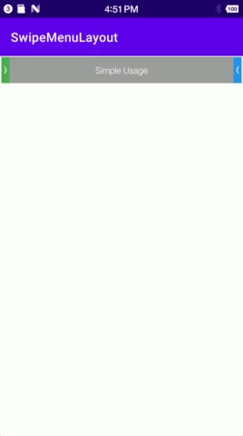
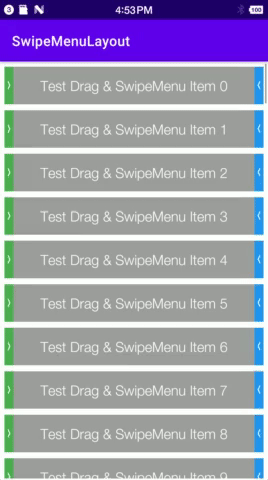
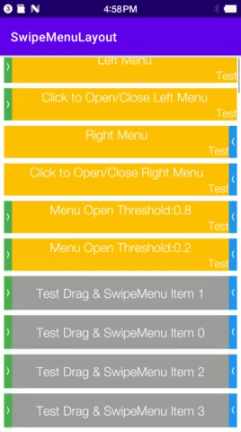

# SwipeMenuLayout
[](https://jitpack.io/v/benjaminwan/SwipeMenuLayout.svg)
[](https://github.com/benjaminwan/SwipeMenuLayout/issues)
[](https://github.com/benjaminwan/SwipeMenuLayout)

## [English](./README.md) | [Chinese](./README_zh.md)

### Introduction
SwipeMenuLayout is an Android side-sliding menu widget.
It supports swipe left (right menu) or swipe right (left menu), and can be used in RecyclerView, support long press drag and drop.
demo implementation: Kotlin+epoxy+Mavericks
[Mavericks](https://github.com/airbnb/mavericks)
[epoxy](https://github.com/airbnb/epoxy)

#### Demo Picture
##### Simple example


##### RecyclerView+Adapter


##### RecyclerView+epoxy+types


### Installation
0. root build.gradle add
```groovy
repositories {
        google()
        jcenter()
        maven { url "https://jitpack.io" }
    }
```
1. Simple example, dependency: Core
2. RecyclerView+Adapter，dependency:Core and Helper
3. RecyclerView+Epoxy，dependency: All
```groovy
dependencies {
    //Widget
    implementation 'com.github.benjaminwan.SwipeMenuLayout:SwipeMenuLayout-Core:1.0.2'
    //Adapter Helper
    implementation 'com.github.benjaminwan.SwipeMenuLayout:SwipeMenuLayout-Helper:1.0.2'
    //Epoxy Helper
    implementation 'com.github.benjaminwan.SwipeMenuLayout:SwipeMenuLayout-EpoxyHelper:1.0.2'
}
```

### Instructions

#### Define in Layout.xml
The first View under SwipeMenuLayout becomes the contentView by default.
You can also specify the contentView by app:contentView="@id/contentLayout"
```xml
<com.benjaminwan.swipemenulayout.SwipeMenuLayout
    android:id="@+id/swipeLayout"
    android:layout_width="match_parent"
    android:layout_height="wrap_content">
    <TextView
            android:id="@+id/contentLayout"
            android:layout_width="0dp"
            android:layout_height="match_parent"
            android:layout_weight="1"
            android:gravity="center"
            android:text="Simple Usage"
            android:textColor="@color/white" />
</com.benjaminwan.swipemenulayout.SwipeMenuLayout>
```

#### Define Menu in kt file or class
Choose one of two methods
```kotlin
//1. Use DSL
val leftMenus: List<SwipeMenuItem> =
    menuItems {
        menuItem {
            id = 0
            width = 60
            height = ViewGroup.LayoutParams.MATCH_PARENT
            title = getString(R.string.left_delete_title)
            titleSize = 10
            titleColorRes = R.color.selector_white_to_grey5
            backgroundRes = R.drawable.bg_orange5_to_orange7
            iconRes = R.drawable.ic_delete
            iconColorRes = R.color.selector_white_to_grey5
        }
        menuItem {
            id = 1
            width = 80
            height = ViewGroup.LayoutParams.MATCH_PARENT
            title = "Left Clear"
            titleSize = 11
            titleColorRes = R.color.selector_white_to_grey5
            backgroundRes = R.drawable.bg_red5_to_red7
            iconRes = R.drawable.ic_clear
            iconColorRes = R.color.selector_white_to_grey5
        }
    }
//2. Use Builder
val rightMenus: List<SwipeMenuItem> =
    listOf(
        SwipeMenuItem.Builder()
            .setId(10)
            .setWidth(60)
            .setHeight(ViewGroup.LayoutParams.MATCH_PARENT)
            .setTitle(R.string.right_delete_title)
            .setTitleSize(10)
            .setTitleColor(R.color.selector_white_to_grey5)
            .setBackground(R.drawable.bg_red5_to_red7)
            .setIcon(R.drawable.ic_delete)
            .setIconColor(R.color.selector_white_to_grey5)
            .build(),
        SwipeMenuItem.Builder()
            .setId(11)
            .setWidth(80)
            .setHeight(ViewGroup.LayoutParams.MATCH_PARENT)
            .setTitle("Right Restore")
            .setTitleSize(11)
            .setTitleColor(R.color.selector_white_to_grey5)
            .setBackground(R.drawable.bg_green5_to_green7)
            .setIcon(R.drawable.ic_restore)
            .setIconColor(R.color.selector_white_to_grey5)
            .build()
    )
```
#### Create Menu 
```kotlin
swipeLayout.leftMenuView.createMenu(leftMenus)
swipeLayout.rightMenuView.createMenu(rightMenus)
```

#### clear Menu
```kotlin
swipeLayout.leftMenuView.removeAllViews()
swipeLayout.rightMenuView.removeAllViews()
```

#### Control Slide left or right
```kotlin
swipeLayout.leftMenuEnable = true
swipeLayout.rightMenuEnable = true
```

#### Menu open-close event
```kotlin
swipeLayout.addOnMenuClosedListener {
    //...
}
swipeLayout.addOnLeftMenuOpenListener {
    //...
}
swipeLayout.addOnRightMenuOpenListener {
    //...
}
```

#### Menu item click events
```kotlin
swipeLayout.leftMenuView.setOnMenuItemClickListener {
    //...
}
swipeLayout.rightMenuView.setOnMenuItemClickListener {
    //...
}
```

#### RecyclerView+Adapter Drag and drop
```kotlin
val itemTouchHelper = MenuItemTouchHelper(
        MenuItemHelperCallBack(
            object :
                MenuItemDragListener {
                var objectAnimator: ObjectAnimator? = null
                override fun onItemMoved(fromPosition: Int, toPosition: Int) {
                    adapter.move(fromPosition,toPosition)
                }

                override fun onDragStarted(itemView: View?, adapterPosition: Int) {
                    itemView ?: return
                    objectAnimator = itemView.shakeInfinite()
                }

                override fun onDragReleased() {
                    objectAnimator?.cancel()
                }

            })
    )
itemTouchHelper.attachToRecyclerView(recyclerView)
```
#### RecyclerView+Epoxy Drag and drop
```kotlin
EpoxyMenuTouchHelper.initDragging(epoxyController)
            .withRecyclerView(binding.demoRv)
            .forVerticalList()
            .withTarget(MenuDemoItemViewModel_::class.java)
            .andCallbacks(object : EpoxyMenuTouchHelper.DragCallbacks<MenuDemoItemViewModel_>() {
                var objectAnimator: ObjectAnimator? = null

                override fun onModelMoved(
                    fromPosition: Int,
                    toPosition: Int,
                    modelBeingMoved: MenuDemoItemViewModel_?,
                    itemView: View?
                ) {
                    withState(demoVM) {
                        demoVM.swap(fromPosition, toPosition)
                    }
                }

                override fun onDragStarted(
                    model: MenuDemoItemViewModel_?,
                    itemView: View?,
                    adapterPosition: Int
                ) {
                    super.onDragStarted(model, itemView, adapterPosition)
                    itemView ?: return
                    objectAnimator = itemView.shakeInfinite()
                }

                override fun onDragReleased(model: MenuDemoItemViewModel_?, itemView: View?) {
                    super.onDragReleased(model, itemView)
                    objectAnimator?.cancel()
                }
            })
```

#### Other
MenuItemTouchHelper directly copy-paste the code from ItemTouchHelper.

When using drag-and-drop in RecyclerView, Dragging the 1st item causes fast scrolling.

It leads to the fact that the 1st item can't be placed, for instance, to the 2nd position.

It is recommended to replace the first item with a non-draggable view.
